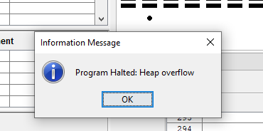
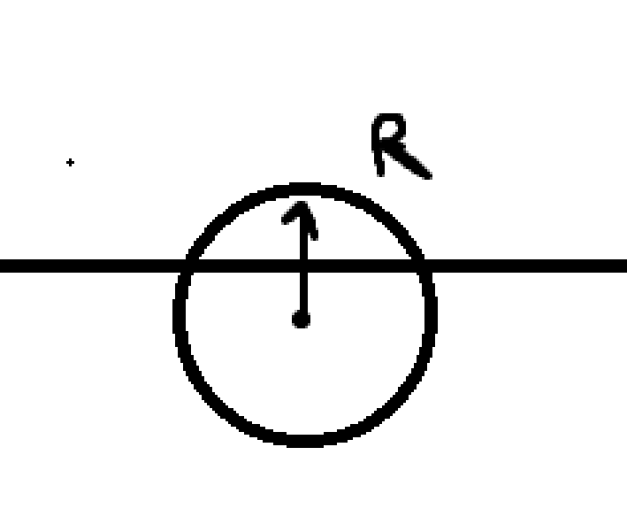
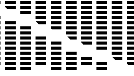

# Прикольно
- Интересная задумка
- Хорошая структура кода
- Наличие комментариев
- Юзер френдли управление
- Stop embarrassing yourself and go train


# Не прикольно

- При нескольких запусках игры стек переполняеться строками из-за не оптимального испоьзования(сохранять текст в переменную)



- Ошибка выхода за предел кругом  

- в 50 % запусков невозможно пройти игру (при нажатие кнопки в пол стрелки платформа не успевает доехать)
- Отсутвие валидации на строки на 0 значени, на значения больше предела 


- Блоки стераються на не исчезают





- Лишняя проверка на выход
```C#
		while (~exit) {
			if (Keyboard.keyPressed() = 140)  { let exit = true; }
			do counter.draw();
			do ball.move();
			do paddle.move();
			do checkAllConditions();
		}
		if (exit) { // лишняя проверка
			do dispose();
			do Screen.clearScreen();
            do Output.moveCursor(10,27);
	        do Output.printString("well go away :(");
			do waitRestart();
	    }
```
-  (0 < speed < 3) ложное описание в readme

# Предложение
- добавить не ломаемые стены, бонусы и музыку бере бе бара бара
