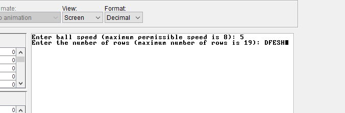
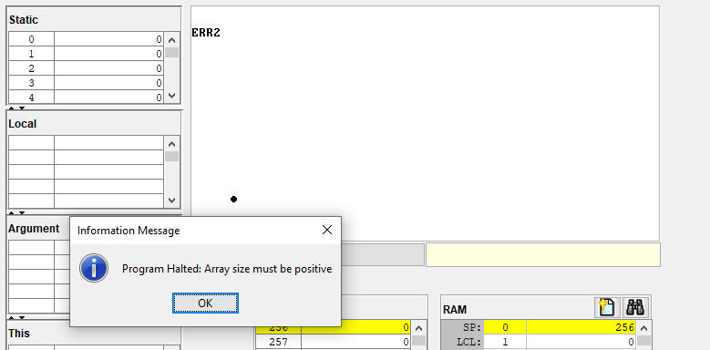
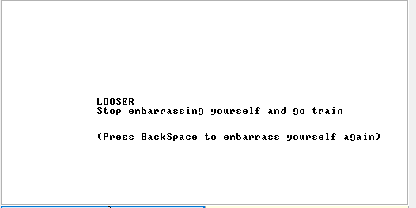

**Плюсы:**

1) Хорошо структурированный код

2) Забавное описание

3) Простая и интересная задумка

**Минусы:**

1) При попытке ввести не числа в начале игры выводит ошибку
"Array size must be positive"

2) Как будто будет красивее, если сделать надпись по центру экрана

3) Не очень вижу смысла задавать разную скорость мяча, если на 
высоких скоростях играть невозможно, так как платформа намного медленнее, чем мяч

**Предложения:**

1) Может стоить увеличить скорость платформы, или хотя бы менять ее в зависимости от скорости мяча? 
Так игра будет динамичнее

2) Добавить возможность рестартнуть игру с уже заданными ранее параметрами,
чтобы не приходилось каждый раз вводить одинаковые настройки?

